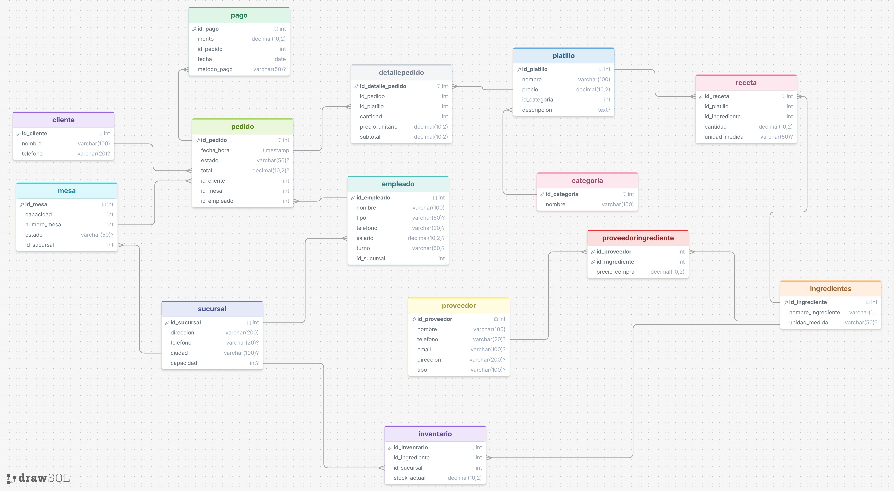

# Base de Datos Restaurante 🍽️


---

## Índice

- [Levantar el proyecto](#levantar-el-proyecto)
- [Resumen de tablas](#resumen-de-tablas)
- [Metadatos por tabla](#metadatos-por-tabla)
  - [Categoria](#-categoria)
  - [Platillo](#-platillo)
  - [Cliente](#-cliente)
  - [Sucursal](#-sucursal)
  - [Empleado](#-empleado)
  - [Mesa](#-mesa)
  - [Pedido](#-pedido)
  - [Pago](#-pago)
  - [Proveedor](#-proveedor)
  - [Ingredientes](#-ingredientes)
  - [ProveedorIngrediente](#-proveedoringrediente)
  - [DetallePedido](#-detallepedido)
  - [Receta](#-receta)
  - [Inventario](#-inventario)
- [Relaciones del modelo](#relaciones-del-modelo)

---

## Levantar el proyecto

```bash
docker compose up -d
```

```bash
docker exec -it restaurante_db psql -U postgres -d restaurante
```

---

## Resumen de tablas

| Tabla                | Registros | Descripción breve                                      |
|----------------------|-----------|--------------------------------------------------------|
| Categoria            | 10        | Clasificación de los platillos del menú                |
| Platillo             | 60        | Catálogo de platillos con precio y descripción         |
| Cliente              | 800       | Base de clientes registrados                           |
| Sucursal             | 5         | Unidades físicas de la cadena de restaurantes          |
| Empleado             | 50        | Personal asignado por sucursal y turno                 |
| Mesa                 | 80        | Mesas disponibles por sucursal                         |
| Pedido               | 1,200     | Transacciones de consumo por mesa y cliente            |
| Pago                 | 1,204     | Liquidaciones de pedidos por método de pago            |
| Proveedor            | 25        | Empresas que suministran ingredientes                  |
| Ingredientes         | 81        | Catálogo de ingredientes usados en recetas             |
| ProveedorIngrediente | 297       | Relación precio-proveedor-ingrediente                  |
| DetallePedido        | 5,348     | Líneas de platillos por pedido                         |
| Receta               | 350       | Composición de ingredientes por platillo               |
| Inventario           | 500       | Stock de ingredientes por sucursal                     |
| **Total**            | **10,010**|                                                        |

---

## Metadatos por tabla

> **Glosario de columnas de metadatos**
>
> | Columna | Descripción |
> |---|---|
> | **Campo** | Nombre exacto del atributo en la base de datos |
> | **Tipo de dato** | Tipo SQL del campo |
> | **Nulable** | Si el campo acepta `NULL` |
> | **Llave** | PK = primaria, FK = foránea, PK+FK = ambas |
> | **Autoincremental** | Si la BD genera el valor sola |
> | **Valor por defecto** | Valor que toma si no se especifica uno |
> | **Longitud / Precisión** | Máx. caracteres o dígitos permitidos |
> | **Rango válido** | Valores aceptables del negocio |
> | **Ejemplo** | Dato real representativo |
> | **Regla de negocio** | Restricción o lógica que aplica más allá del tipo |
> | **Dependencia** | Tabla/campo del que depende si es FK |
> | **Impacto si falta** | Qué se rompe operativamente si el campo está vacío o es incorrecto |

---

### 📋 Categoria

| Campo          | Tipo de dato   | Nulable | Llave | Autoincremental | Valor por defecto | Longitud / Precisión | Rango válido      | Ejemplo      | Regla de negocio                                         | Dependencia | Impacto si falta                                      |
|----------------|----------------|---------|-------|-----------------|-------------------|----------------------|-------------------|--------------|----------------------------------------------------------|-------------|-------------------------------------------------------|
| `id_categoria` | `INT`          | NO      | PK    | SÍ              | —                 | Entero positivo      | ≥ 1               | `3`          | Generado por la BD; no debe modificarse manualmente      | —           | Sin ID no se puede referenciar desde Platillo         |
| `nombre`       | `VARCHAR(100)` | NO      | —     | NO              | —                 | Máx. 100 caracteres  | Texto no vacío    | `"Postres"`  | Debe ser único para evitar duplicados en el menú         | —           | Sin nombre la categoría no tiene significado de negocio|

---

### 🍽️ Platillo

| Campo          | Tipo de dato    | Nulable | Llave | Autoincremental | Valor por defecto | Longitud / Precisión     | Rango válido        | Ejemplo               | Regla de negocio                                                             | Dependencia                    | Impacto si falta                                               |
|----------------|-----------------|---------|-------|-----------------|-------------------|--------------------------|---------------------|-----------------------|------------------------------------------------------------------------------|--------------------------------|----------------------------------------------------------------|
| `id_platillo`  | `INT`           | NO      | PK    | SÍ              | —                 | Entero positivo          | ≥ 1                 | `12`                  | Generado por la BD; referenciado por DetallePedido y Receta                  | —                              | Sin ID no puede aparecer en pedidos ni recetas                 |
| `nombre`       | `VARCHAR(100)`  | NO      | —     | NO              | —                 | Máx. 100 caracteres      | Texto no vacío      | `"Tacos de pastor"`   | Nombre tal como aparece en el menú impreso o digital                         | —                              | Sin nombre no puede mostrarse en el menú al cliente            |
| `precio`       | `DECIMAL(10,2)` | NO      | —     | NO              | —                 | 10 dígitos, 2 decimales  | > 0.00              | `89.50`               | Precio de venta al público; debe ser mayor a cero                            | —                              | Sin precio no se puede calcular el total del pedido            |
| `id_categoria` | `INT`           | NO      | FK    | NO              | —                 | Entero positivo          | Debe existir en Categoria | `3`          | Cada platillo pertenece a exactamente una categoría                          | `Categoria.id_categoria`       | Sin categoría el platillo no puede clasificarse en el menú     |
| `descripcion`  | `TEXT`          | SÍ      | —     | NO              | `NULL`            | Sin límite de caracteres | Cualquier texto     | `"Tortilla maíz, cilantro, cebolla, salsa verde"` | Informativo; no afecta operación transaccional     | —                              | Impacto bajo; solo afecta presentación al cliente              |

---

### 👤 Cliente

| Campo        | Tipo de dato   | Nulable | Llave | Autoincremental | Valor por defecto | Longitud / Precisión | Rango válido    | Ejemplo          | Regla de negocio                                                    | Dependencia | Impacto si falta                                        |
|--------------|----------------|---------|-------|-----------------|-------------------|----------------------|-----------------|------------------|---------------------------------------------------------------------|-------------|---------------------------------------------------------|
| `id_cliente` | `INT`          | NO      | PK    | SÍ              | —                 | Entero positivo      | ≥ 1             | `247`            | Generado por la BD; cada cliente tiene un ID irrepetible            | —           | Sin ID no se puede asociar pedidos al cliente           |
| `nombre`     | `VARCHAR(100)` | NO      | —     | NO              | —                 | Máx. 100 caracteres  | Texto no vacío  | `"Ana López"`    | Nombre completo; mínimo nombre de pila para identificación          | —           | Sin nombre no se puede identificar al cliente en reportes|
| `telefono`   | `VARCHAR(20)`  | SÍ      | —     | NO              | `NULL`            | Máx. 20 caracteres   | Dígitos y guiones | `"664-123-4567"` | Opcional; se usa VARCHAR porque puede incluir código de país o guiones | —        | Sin teléfono no se puede contactar al cliente           |

---

### 🏢 Sucursal

| Campo         | Tipo de dato   | Nulable | Llave | Autoincremental | Valor por defecto | Longitud / Precisión | Rango válido       | Ejemplo                        | Regla de negocio                                                          | Dependencia | Impacto si falta                                              |
|---------------|----------------|---------|-------|-----------------|-------------------|----------------------|--------------------|--------------------------------|---------------------------------------------------------------------------|-------------|---------------------------------------------------------------|
| `id_sucursal` | `INT`          | NO      | PK    | SÍ              | —                 | Entero positivo      | ≥ 1                | `2`                            | Referenciado por Mesa, Empleado e Inventario; no debe eliminarse si tiene dependientes | —  | Sin ID no pueden asociarse empleados, mesas ni inventario     |
| `direccion`   | `VARCHAR(200)` | NO      | —     | NO              | —                 | Máx. 200 caracteres  | Texto no vacío     | `"Av. Revolución 450, Col. Centro"` | Dirección completa incluyendo colonia y número exterior             | —           | Sin dirección la sucursal no puede ubicarse físicamente       |
| `telefono`    | `VARCHAR(20)`  | SÍ      | —     | NO              | `NULL`            | Máx. 20 caracteres   | Dígitos y guiones  | `"664-987-6543"`               | Opcional; teléfono principal de la sucursal para reservas o quejas        | —           | Sin teléfono los clientes no pueden contactar la sucursal     |
| `ciudad`      | `VARCHAR(100)` | SÍ      | —     | NO              | `NULL`            | Máx. 100 caracteres  | Texto no vacío     | `"Tijuana"`                    | Ciudad donde opera; útil para segmentación geográfica en reportes         | —           | Sin ciudad no se puede filtrar por región en análisis         |
| `capacidad`   | `INT`          | SÍ      | —     | NO              | `NULL`            | Entero positivo      | > 0                | `120`                          | Aforo máximo simultáneo; debe reflejar el tamaño físico real del local    | —           | Sin capacidad no se puede controlar el límite de ocupación    |

---

### 👨‍🍳 Empleado

| Campo         | Tipo de dato    | Nulable | Llave | Autoincremental | Valor por defecto | Longitud / Precisión    | Rango válido                          | Ejemplo           | Regla de negocio                                                                    | Dependencia              | Impacto si falta                                          |
|---------------|-----------------|---------|-------|-----------------|-------------------|-------------------------|---------------------------------------|-------------------|-------------------------------------------------------------------------------------|--------------------------|-----------------------------------------------------------|
| `id_empleado` | `INT`           | NO      | PK    | SÍ              | —                 | Entero positivo         | ≥ 1                                   | `8`               | Referenciado por Pedido; no debe eliminarse si tiene pedidos asociados              | —                        | Sin ID no puede asociarse a pedidos ni turnos             |
| `nombre`      | `VARCHAR(100)`  | NO      | —     | NO              | —                 | Máx. 100 caracteres     | Texto no vacío                        | `"Carlos Reyes"`  | Nombre completo del empleado tal como aparece en nómina                             | —                        | Sin nombre no puede identificarse en reportes de servicio |
| `tipo`        | `VARCHAR(50)`   | SÍ      | —     | NO              | `NULL`            | Máx. 50 caracteres      | mesero / cocinero / cajero / gerente  | `"mesero"`        | Define qué operaciones puede realizar; se recomienda usar valores controlados       | —                        | Sin tipo no puede asignarse rol ni permisos de sistema    |
| `telefono`    | `VARCHAR(20)`   | SÍ      | —     | NO              | `NULL`            | Máx. 20 caracteres      | Dígitos y guiones                     | `"664-555-1234"`  | Contacto de emergencia o coordinación de turno                                      | —                        | Sin teléfono no puede contactarse en caso de ausencia     |
| `salario`     | `DECIMAL(10,2)` | SÍ      | —     | NO              | `NULL`            | 10 dígitos, 2 decimales | > 0.00                                | `8500.00`         | Expresado en moneda local (MXN); debe ser mayor al salario mínimo vigente           | —                        | Sin salario no puede procesarse nómina                    |
| `turno`       | `VARCHAR(50)`   | SÍ      | —     | NO              | `NULL`            | Máx. 50 caracteres      | matutino / vespertino / nocturno      | `"vespertino"`    | Determina el horario de trabajo; debe coordinarse con la cobertura de la sucursal   | —                        | Sin turno no puede asignarse a horario de atención        |
| `id_sucursal` | `INT`           | NO      | FK    | NO              | —                 | Entero positivo         | Debe existir en Sucursal              | `2`               | Todo empleado debe pertenecer a una sucursal activa                                 | `Sucursal.id_sucursal`   | Sin sucursal el empleado no puede asignarse a operaciones |

---

### 🪑 Mesa

| Campo          | Tipo de dato   | Nulable | Llave | Autoincremental | Valor por defecto | Longitud / Precisión | Rango válido                         | Ejemplo       | Regla de negocio                                                                         | Dependencia            | Impacto si falta                                              |
|----------------|----------------|---------|-------|-----------------|-------------------|----------------------|--------------------------------------|---------------|------------------------------------------------------------------------------------------|------------------------|---------------------------------------------------------------|
| `id_mesa`      | `INT`          | NO      | PK    | SÍ              | —                 | Entero positivo      | ≥ 1                                  | `15`          | Referenciado por Pedido; identifica de forma única cada mesa en toda la cadena           | —                      | Sin ID no puede asociarse un pedido a una mesa                |
| `capacidad`    | `INT`          | NO      | —     | NO              | —                 | Entero positivo      | > 0                                  | `4`           | Número de comensales que físicamente caben; usada para asignación óptima de mesas        | —                      | Sin capacidad no puede gestionarse la distribución del salón  |
| `numero_mesa`  | `INT`          | NO      | —     | NO              | —                 | Entero positivo      | > 0                                  | `7`           | Número visible en el local; puede repetirse entre sucursales (no es único globalmente)   | —                      | Sin número el mesero no puede identificar la mesa físicamente |
| `estado`       | `VARCHAR(50)`  | SÍ      | —     | NO              | `NULL`            | Máx. 50 caracteres   | disponible / ocupada / reservada     | `"ocupada"`   | Actualizado en tiempo real; base para gestión de disponibilidad del salón                | —                      | Sin estado no puede saberse si la mesa está disponible        |
| `id_sucursal`  | `INT`          | NO      | FK    | NO              | —                 | Entero positivo      | Debe existir en Sucursal             | `1`           | Cada mesa pertenece a exactamente una sucursal; no puede compartirse entre locales       | `Sucursal.id_sucursal` | Sin sucursal la mesa no puede ubicarse en ningún local        |

---

### 📝 Pedido

| Campo         | Tipo de dato    | Nulable | Llave | Autoincremental | Valor por defecto        | Longitud / Precisión    | Rango válido                              | Ejemplo               | Regla de negocio                                                                             | Dependencia               | Impacto si falta                                                  |
|---------------|-----------------|---------|-------|-----------------|--------------------------|-------------------------|-------------------------------------------|-----------------------|----------------------------------------------------------------------------------------------|---------------------------|-------------------------------------------------------------------|
| `id_pedido`   | `INT`           | NO      | PK    | SÍ              | —                        | Entero positivo         | ≥ 1                                       | `1089`                | Referenciado por Pago y DetallePedido; es el núcleo de toda transacción                      | —                         | Sin ID no puede vincularse ningún detalle ni pago                 |
| `fecha_hora`  | `TIMESTAMP`     | NO      | —     | NO              | `NOW()` recomendado      | —                       | Fecha válida ≤ fecha actual               | `2024-11-15 13:45:00` | Capturado automáticamente al abrir el pedido; no debe modificarse retroactivamente           | —                         | Sin fecha no puede ordenarse cronológicamente ni auditarse        |
| `estado`      | `VARCHAR(50)`   | SÍ      | —     | NO              | `"en proceso"`           | Máx. 50 caracteres      | en proceso / entregado / cancelado        | `"entregado"`         | Refleja el ciclo de vida del pedido; debe actualizarse en cada cambio de etapa               | —                         | Sin estado no puede saberse si el pedido fue completado o cancelado|
| `total`       | `DECIMAL(10,2)` | SÍ      | —     | NO              | Calculado                | 10 dígitos, 2 decimales | ≥ 0.00                                   | `350.00`              | Debe coincidir con la suma de subtotales en DetallePedido; inconsistencia indica error       | —                         | Sin total no puede cobrarse ni cuadrarse la caja                  |
| `id_cliente`  | `INT`           | NO      | FK    | NO              | —                        | Entero positivo         | Debe existir en Cliente                   | `247`                 | Todo pedido debe tener un cliente; permite análisis de frecuencia y fidelización             | `Cliente.id_cliente`      | Sin cliente no puede identificarse a quién se atiende             |
| `id_mesa`     | `INT`           | NO      | FK    | NO              | —                        | Entero positivo         | Debe existir en Mesa                      | `15`                  | Define dónde se consumió; la mesa debe estar en la misma sucursal que el empleado            | `Mesa.id_mesa`            | Sin mesa no puede saberse dónde ocurrió el servicio               |
| `id_empleado` | `INT`           | NO      | FK    | NO              | —                        | Entero positivo         | Debe existir en Empleado                  | `8`                   | Mesero responsable del pedido; base para métricas de desempeño por empleado                  | `Empleado.id_empleado`    | Sin empleado no puede responsabilizarse el servicio a nadie       |

---

### 💳 Pago

| Campo          | Tipo de dato    | Nulable | Llave | Autoincremental | Valor por defecto   | Longitud / Precisión    | Rango válido                                        | Ejemplo          | Regla de negocio                                                                    | Dependencia          | Impacto si falta                                             |
|----------------|-----------------|---------|-------|-----------------|---------------------|-------------------------|-----------------------------------------------------|------------------|-------------------------------------------------------------------------------------|----------------------|--------------------------------------------------------------|
| `id_pago`      | `INT`           | NO      | PK    | SÍ              | —                   | Entero positivo         | ≥ 1                                                 | `1089`           | Un pedido puede tener múltiples pagos (pago dividido entre comensales)              | —                    | Sin ID no puede rastrearse el pago en auditorías             |
| `monto`        | `DECIMAL(10,2)` | NO      | —     | NO              | —                   | 10 dígitos, 2 decimales | > 0.00                                              | `350.00`         | La suma de montos por pedido debe cubrir el total del pedido                        | —                    | Sin monto no puede cerrarse la transacción financiera        |
| `id_pedido`    | `INT`           | NO      | FK    | NO              | —                   | Entero positivo         | Debe existir en Pedido                              | `1089`           | Vincula el cobro con la transacción de consumo; relación obligatoria                | `Pedido.id_pedido`   | Sin pedido el pago queda huérfano y no puede contabilizarse  |
| `fecha`        | `DATE`          | NO      | —     | NO              | `CURRENT_DATE` rec. | —                       | Fecha válida ≤ fecha actual                         | `2024-11-15`     | Fecha de liquidación; puede diferir de la fecha del pedido en pagos diferidos       | —                    | Sin fecha no puede cuadrarse el corte de caja por día        |
| `metodo_pago`  | `VARCHAR(50)`   | SÍ      | —     | NO              | `NULL`              | Máx. 50 caracteres      | efectivo / tarjeta crédito / tarjeta débito / transferencia | `"tarjeta crédito"` | Relevante para conciliación bancaria; se recomienda usar valores controlados | —                    | Sin método no puede conciliarse el ingreso por forma de cobro|

---

### 🚚 Proveedor

| Campo          | Tipo de dato   | Nulable | Llave | Autoincremental | Valor por defecto | Longitud / Precisión | Rango válido    | Ejemplo                      | Regla de negocio                                                         | Dependencia | Impacto si falta                                            |
|----------------|----------------|---------|-------|-----------------|-------------------|----------------------|-----------------|------------------------------|--------------------------------------------------------------------------|-------------|-------------------------------------------------------------|
| `id_proveedor` | `INT`          | NO      | PK    | SÍ              | —                 | Entero positivo      | ≥ 1             | `7`                          | Referenciado por ProveedorIngrediente; base del catálogo de suministros  | —           | Sin ID no puede vincularse a ningún ingrediente             |
| `nombre`       | `VARCHAR(100)` | NO      | —     | NO              | —                 | Máx. 100 caracteres  | Texto no vacío  | `"Lácteos del Norte S.A."`   | Razón social o nombre comercial; debe ser único para evitar duplicados   | —           | Sin nombre no puede identificarse al proveedor en órdenes  |
| `telefono`     | `VARCHAR(20)`  | SÍ      | —     | NO              | `NULL`            | Máx. 20 caracteres   | Dígitos/guiones | `"800-123-4567"`             | Canal principal de contacto para órdenes de compra urgentes              | —           | Sin teléfono no puede contactarse ante desabasto            |
| `email`        | `VARCHAR(100)` | SÍ      | —     | NO              | `NULL`            | Máx. 100 caracteres  | Formato válido de email | `"ventas@lacteosdn.com"` | Canal formal para pedidos y facturación; debe incluir `@` y dominio  | —           | Sin email no puede enviarse orden de compra formal          |
| `direccion`    | `VARCHAR(200)` | SÍ      | —     | NO              | `NULL`            | Máx. 200 caracteres  | Texto no vacío  | `"Blvd. Industrial 300, Monterrey"` | Dirección de entrega o fiscal; relevante para logística          | —           | Sin dirección no puede coordinarse entrega de mercancía     |
| `tipo`         | `VARCHAR(100)` | SÍ      | —     | NO              | `NULL`            | Máx. 100 caracteres  | Texto descriptivo | `"lácteos"`               | Categoría del proveedor; permite filtrar por especialidad en compras     | —           | Sin tipo no puede segmentarse por categoría en reportes     |

---

### 🧅 Ingredientes

| Campo                | Tipo de dato   | Nulable | Llave | Autoincremental | Valor por defecto | Longitud / Precisión | Rango válido    | Ejemplo             | Regla de negocio                                                             | Dependencia | Impacto si falta                                             |
|----------------------|----------------|---------|-------|-----------------|-------------------|----------------------|-----------------|---------------------|------------------------------------------------------------------------------|-------------|--------------------------------------------------------------|
| `id_ingrediente`     | `INT`          | NO      | PK    | SÍ              | —                 | Entero positivo      | ≥ 1             | `34`                | Referenciado por Receta, ProveedorIngrediente e Inventario                   | —           | Sin ID el ingrediente no puede usarse en recetas ni pedirse  |
| `nombre_ingrediente` | `VARCHAR(100)` | NO      | —     | NO              | —                 | Máx. 100 caracteres  | Texto no vacío  | `"Tomate saladet"` | Nombre estandarizado; evitar sinónimos (ej. "jitomate" vs "tomate")          | —           | Sin nombre no puede identificarse en inventario ni recetas   |
| `unidad_medida`      | `VARCHAR(50)`  | SÍ      | —     | NO              | `NULL`            | Máx. 50 caracteres   | kg / litros / piezas / gramos | `"kg"` | Define cómo se compra y cómo se consume; debe ser consistente con Receta e Inventario | —  | Sin unidad no puede calcularse el costo ni el consumo exacto |

---

### 🔗 ProveedorIngrediente *(tabla pivote)*

| Campo            | Tipo de dato    | Nulable | Llave   | Autoincremental | Valor por defecto | Longitud / Precisión    | Rango válido                       | Ejemplo | Regla de negocio                                                                               | Dependencia                          | Impacto si falta                                                   |
|------------------|-----------------|---------|---------|-----------------|-------------------|-------------------------|------------------------------------|---------|------------------------------------------------------------------------------------------------|--------------------------------------|--------------------------------------------------------------------|
| `id_proveedor`   | `INT`           | NO      | PK + FK | NO              | —                 | Entero positivo         | Debe existir en Proveedor          | `7`     | Parte de la PK compuesta; identifica al proveedor en la relación                               | `Proveedor.id_proveedor`             | Sin proveedor no puede registrarse el suministro del ingrediente   |
| `id_ingrediente` | `INT`           | NO      | PK + FK | NO              | —                 | Entero positivo         | Debe existir en Ingredientes       | `34`    | Parte de la PK compuesta; identifica el ingrediente suministrado                               | `Ingredientes.id_ingrediente`        | Sin ingrediente la relación no tiene objeto                        |
| `precio_compra`  | `DECIMAL(10,2)` | NO      | —       | NO              | —                 | 10 dígitos, 2 decimales | > 0.00                             | `45.00` | Precio por unidad de medida del ingrediente de ese proveedor; actualizable por renegociación   | —                                    | Sin precio no puede calcularse el costo de producción de recetas   |

> **Nota:** La PK compuesta `(id_proveedor, id_ingrediente)` garantiza que no se duplique la relación entre un proveedor y un ingrediente. Si el mismo ingrediente lo ofrecen dos proveedores, se registran dos filas con precios distintos, permitiendo comparación para decisiones de compra.

---

### 🧾 DetallePedido

| Campo                | Tipo de dato    | Nulable | Llave | Autoincremental | Valor por defecto | Longitud / Precisión    | Rango válido                   | Ejemplo  | Regla de negocio                                                                                             | Dependencia                  | Impacto si falta                                                     |
|----------------------|-----------------|---------|-------|-----------------|-------------------|-------------------------|--------------------------------|----------|--------------------------------------------------------------------------------------------------------------|------------------------------|----------------------------------------------------------------------|
| `id_detalle_pedido`  | `INT`           | NO      | PK    | SÍ              | —                 | Entero positivo         | ≥ 1                            | `4201`   | Cada renglón es independiente; un pedido puede tener N detalles                                              | —                            | Sin ID no puede rastrearse individualmente cada línea del pedido     |
| `id_pedido`          | `INT`           | NO      | FK    | NO              | —                 | Entero positivo         | Debe existir en Pedido         | `1089`   | Agrupa los renglones bajo un mismo pedido; si el pedido se cancela, sus detalles pierden validez             | `Pedido.id_pedido`           | Sin pedido el detalle queda huérfano e inconsistente                 |
| `id_platillo`        | `INT`           | NO      | FK    | NO              | —                 | Entero positivo         | Debe existir en Platillo       | `12`     | Identifica qué se ordenó; permite análisis de platillos más vendidos                                         | `Platillo.id_platillo`       | Sin platillo no puede saberse qué se consumió ni costear la receta   |
| `cantidad`           | `INT`           | NO      | —     | NO              | —                 | Entero positivo         | ≥ 1                            | `2`      | Mínimo 1 porción; no puede ser cero ni negativo                                                              | —                            | Sin cantidad no puede calcularse el subtotal ni gestionar inventario |
| `precio_unitario`    | `DECIMAL(10,2)` | NO      | —     | NO              | —                 | 10 dígitos, 2 decimales | > 0.00                         | `89.50`  | *Snapshot* del precio al momento del pedido; no cambia aunque el catálogo se actualice                       | —                            | Sin precio_unitario el subtotal no puede calcularse ni auditarse     |
| `subtotal`           | `DECIMAL(10,2)` | NO      | —     | NO              | Calculado         | 10 dígitos, 2 decimales | ≥ 0.00                         | `179.00` | Siempre debe ser igual a `cantidad × precio_unitario`; inconsistencia indica error de inserción              | —                            | Sin subtotal no puede calcularse correctamente el total del pedido   |

> **Nota:** `precio_unitario` actúa como historial de precios. Si el precio de un platillo cambia en el catálogo, los pedidos anteriores conservan el precio con el que se cobró originalmente.

---

### 📖 Receta

| Campo            | Tipo de dato    | Nulable | Llave | Autoincremental | Valor por defecto | Longitud / Precisión    | Rango válido                    | Ejemplo  | Regla de negocio                                                                            | Dependencia                      | Impacto si falta                                                      |
|------------------|-----------------|---------|-------|-----------------|-------------------|-------------------------|---------------------------------|----------|---------------------------------------------------------------------------------------------|----------------------------------|-----------------------------------------------------------------------|
| `id_receta`      | `INT`           | NO      | PK    | SÍ              | —                 | Entero positivo         | ≥ 1                             | `88`     | Cada fila es un ingrediente de un platillo; un platillo tiene tantas filas como ingredientes | —                               | Sin ID no puede referenciarse la línea de receta individualmente      |
| `id_platillo`    | `INT`           | NO      | FK    | NO              | —                 | Entero positivo         | Debe existir en Platillo        | `12`     | Relaciona la receta con el platillo que la usa; base para costeo de producción              | `Platillo.id_platillo`           | Sin platillo la receta no tiene propietario y no puede usarse         |
| `id_ingrediente` | `INT`           | NO      | FK    | NO              | —                 | Entero positivo         | Debe existir en Ingredientes    | `34`     | Define qué ingrediente se usa; vinculado con Inventario para calcular consumo               | `Ingredientes.id_ingrediente`    | Sin ingrediente no puede calcularse el costo ni el consumo de stock   |
| `cantidad`       | `DECIMAL(10,2)` | NO      | —     | NO              | —                 | 10 dígitos, 2 decimales | > 0.00                          | `0.25`   | Cantidad necesaria por **una porción** del platillo; escala con el número de porciones pedidas | —                             | Sin cantidad no puede determinarse cuánto inventario consume un pedido|
| `unidad_medida`  | `VARCHAR(50)`   | SÍ      | —     | NO              | `NULL`            | Máx. 50 caracteres      | kg / litros / piezas / gramos   | `"kg"`   | Puede diferir de la unidad en Ingredientes si se usan distintas granularidades              | —                                | Sin unidad la cantidad no tiene interpretación válida                 |

---

### 📦 Inventario

| Campo            | Tipo de dato    | Nulable | Llave | Autoincremental | Valor por defecto | Longitud / Precisión    | Rango válido                    | Ejemplo  | Regla de negocio                                                                                      | Dependencia                      | Impacto si falta                                                      |
|------------------|-----------------|---------|-------|-----------------|-------------------|-------------------------|---------------------------------|----------|-------------------------------------------------------------------------------------------------------|----------------------------------|-----------------------------------------------------------------------|
| `id_inventario`  | `INT`           | NO      | PK    | SÍ              | —                 | Entero positivo         | ≥ 1                             | `312`    | Cada fila es una combinación sucursal-ingrediente; no debería repetirse el mismo par                  | —                                | Sin ID no puede rastrearse el registro de stock individualmente       |
| `id_ingrediente` | `INT`           | NO      | FK    | NO              | —                 | Entero positivo         | Debe existir en Ingredientes    | `34`     | Indica de qué ingrediente se registra el stock; base para alertas de reabastecimiento                 | `Ingredientes.id_ingrediente`    | Sin ingrediente no puede saberse qué materia prima se está midiendo   |
| `id_sucursal`    | `INT`           | NO      | FK    | NO              | —                 | Entero positivo         | Debe existir en Sucursal        | `2`      | Stock separado por sucursal; cada local gestiona su propio almacén                                    | `Sucursal.id_sucursal`           | Sin sucursal el stock no puede asignarse a ningún local               |
| `stock_actual`   | `DECIMAL(10,2)` | NO      | —     | NO              | —                 | 10 dígitos, 2 decimales | ≥ 0.00                          | `12.50`  | Actualizado en cada entrada de mercancía o consumo por pedido; no debe ser negativo                   | —                                | Sin stock no puede generarse ninguna alerta de desabasto              |

---

## Relaciones del modelo

| Tabla origen         | Tabla destino   | Tipo        | Campo origen         | Campo destino         | Descripción                                                 |
|----------------------|-----------------|-------------|----------------------|-----------------------|-------------------------------------------------------------|
| Platillo             | Categoria       | N → 1       | `id_categoria`       | `id_categoria`        | Cada platillo pertenece a una categoría                     |
| Pedido               | Cliente         | N → 1       | `id_cliente`         | `id_cliente`          | Cada pedido es realizado por un cliente                     |
| Pedido               | Mesa            | N → 1       | `id_mesa`            | `id_mesa`             | Cada pedido ocurre en una mesa                              |
| Pedido               | Empleado        | N → 1       | `id_empleado`        | `id_empleado`         | Cada pedido es atendido por un empleado                     |
| Pago                 | Pedido          | N → 1       | `id_pedido`          | `id_pedido`           | Un pedido puede liquidarse en uno o más pagos               |
| DetallePedido        | Pedido          | N → 1       | `id_pedido`          | `id_pedido`           | Un pedido contiene uno o más renglones de detalle           |
| DetallePedido        | Platillo        | N → 1       | `id_platillo`        | `id_platillo`         | Cada renglón corresponde a un platillo del menú             |
| Receta               | Platillo        | N → 1       | `id_platillo`        | `id_platillo`         | Un platillo tiene múltiples líneas de receta                |
| Receta               | Ingredientes    | N → 1       | `id_ingrediente`     | `id_ingrediente`      | Cada línea de receta usa un ingrediente                     |
| ProveedorIngrediente | Proveedor       | N → 1       | `id_proveedor`       | `id_proveedor`        | Relación precio entre proveedor e ingrediente               |
| ProveedorIngrediente | Ingredientes    | N → 1       | `id_ingrediente`     | `id_ingrediente`      | Relación precio entre ingrediente y proveedor               |
| Empleado             | Sucursal        | N → 1       | `id_sucursal`        | `id_sucursal`         | Cada empleado trabaja en una sucursal                       |
| Mesa                 | Sucursal        | N → 1       | `id_sucursal`        | `id_sucursal`         | Cada mesa pertenece a una sucursal                          |
| Inventario           | Ingredientes    | N → 1       | `id_ingrediente`     | `id_ingrediente`      | Stock de un ingrediente en una sucursal                     |
| Inventario           | Sucursal        | N → 1       | `id_sucursal`        | `id_sucursal`         | Stock de ingredientes separado por sucursal                 |
